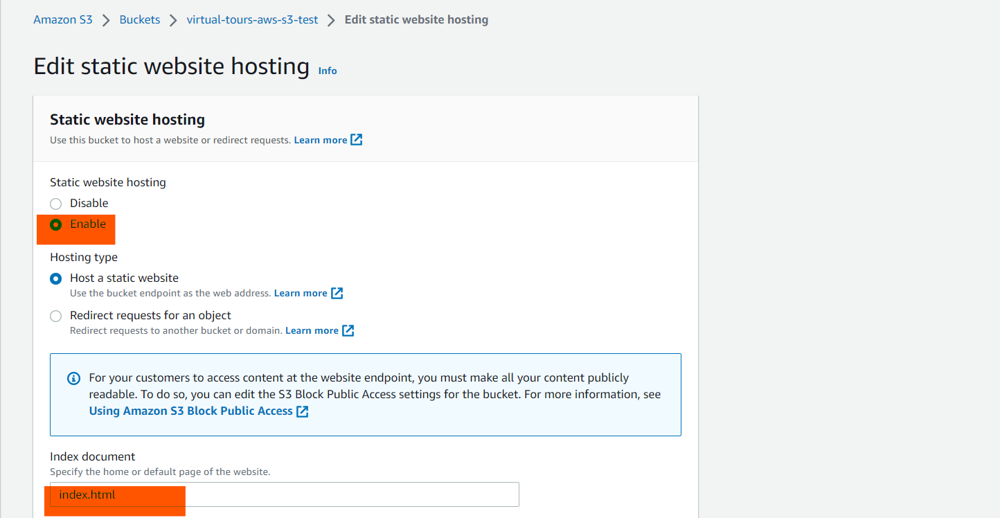

# How to Export a 3D Vista Project and Import it to AWS S3 for Making it Accessible as a Website.

## Step 1: Exporting the 3D Vista Project

Open the 3D Vista software on your computer. Once the software is open, you will see a window displaying your recent projects. Select the project that you want to export to AWS S3.


After opening your project, you will see a window similar to the one below:


 Click on the **Publish** button located at the bottom right of your screen. After clicking on this button, a new window will appear. Select the "**Web / Mobile**" option.


Change the destination of the project to be exported by clicking on the button below. 


Then, choose the location where you want to save your exported project. In my case, I will save it on my desktop in the folder "**AWS-S3-Virtual-tours**". You can create your own folder 

**Note: The folder name should not contain spaces.**


Once the destination is selected, click on the **Select a folder** button to confirm your choice.


Then, click on the **Publish** button to start the process of exporting your project.


Your project has been successfully published to the destination you selected.


I chose the desktop as the destination to save my project in the folder "**AWS-S3-Virtual-tours**". Here's what the exported project looks like:


Congratulations! You have successfully exported your 3D Vista project to your backup folder.


## Step 2: Creating an S3 Bucket

Start by logging in to your AWS account by going to the following address: [https://console.aws.amazon.com/](https://console.aws.amazon.com/)

Once on the AWS login interface, enter your AWS account login information.


After logging in, you will see an interface similar to the one below:


In the search bar at the top left, type `s3`. Among the results that appear, click on the first option with `s3`.


You will be redirected to the following page:


Click on the "**Create bucket**" button. On the new page, enter the name of your bucket and choose the region where your bucket will be created. Select a region close to your users.

**Note: The name of your bucket must be unique.**


Next, scroll down to the section "**Block Public Access settings for this bucket**".


Uncheck the "**Block all public access**" box, then check the box that says "I acknowledge..." Leave all other parameters with their default values. Scroll down to the bottom and click on the "**Create bucket**" button.


Your S3 Bucket has been created successfully.


## Step 3: Importing 3D Vista Files to AWS S3

In the S3 bucket you just created, click on the "**upload**" button.


Next, in the new window, click on "**Add folder**".


In the next window that appears, select the folder previously exported from 3D Vista. In my case, it was "**AWS-S3-Virtual-tours**". Then, click on "import".


Scroll down and click on "**Upload**". After a few seconds, you will see the following message:


The import is now successfully completed.

## Step 4: Configuring the S3 Bucket

In your bucket, click on the tab "**properties**".


In the "**properties**" tab, scroll down to the section "**Static website hosting**" and click on "**Edit**".


In the next page, enable static website hosting, and at the bottom, enter `index.html` for the index document.



Then, scroll down to the bottom and click on the "**save changes**" button.

Next, go to the tab "**Permissions**". You should have the following configuration:


Then, go to the section "**Bucket policy**" and click on the "**Edit**" button. Replace **virtual-tours-aws-s3-test** with the name of your S3 bucket in the code below:

```
{
    "Version": "2012-10-17",
    "Statement": [
        {
            "Sid": "PublicReadGetObject",
            "Effect": "Allow",
            "Principal": "*",
            "Action": "s3:GetObject",
            "Resource": "arn:aws:s3:::virtual-tours-aws-s3-test/*"
        }
    ]
}
```
then paste it here 


Scroll down to the bottom and click on the "**save changes**" button. Once saved, you will see this:


Go back to the "**Objects**" tab and open your 3D Vista project.


Click on your object `index.htm`. On the new page, copy the URL of the object from the bottom right.


Paste the URL of the object into your web browser.


Congratulations, it's working!

